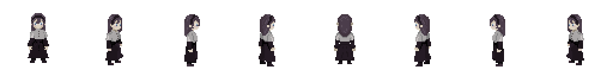
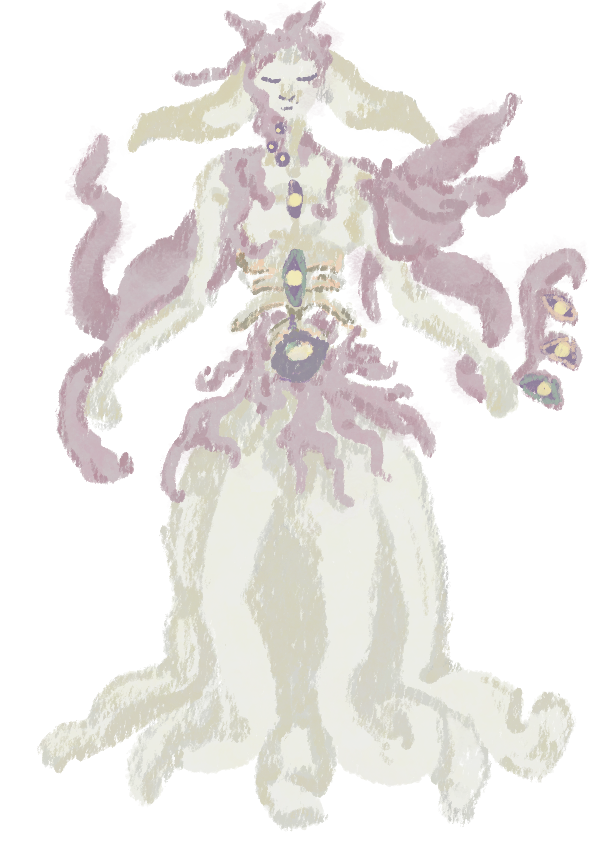
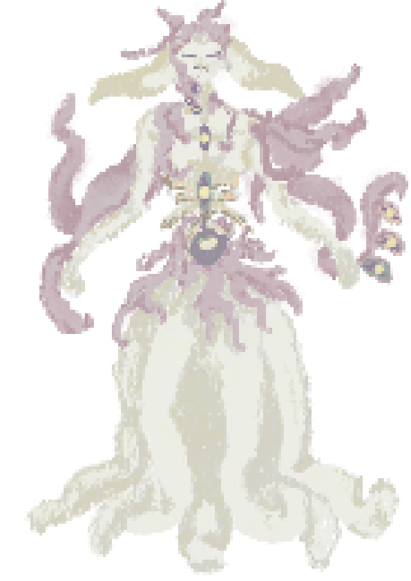

# Mysterious Girl
*päivitetty 10.2.2026*

### Tarkoitus
- viaton, hiljainen tyttö, jonka pelaaja löytää keskeltä hubin raunioita
- avainhahmo pelin edistyksen kannalta
- Pelin viimeinen boss fight

### Kerronnallinen rooli
- näyttäytyy viattomana, hiljaisena tyttönä, joka on jostain syystä kiinnostunut esineistä, joita pelaaja tuo luolastoista
- Toimii "vartijana" (Keeper) pelaajalle, auttaa pelaajaa edistymään
- Ei kuitenkaan kerro pelaajalle, että uusilla kyvyillä, artifacteilla tms on negatiivisia vaikutuksia. Oikeasti silminnähden
viaton tyttö käyttääkin pelaajaa hyväkseen, jotta saisi vanhat voimansa takaisin. 

### Toiminnot pelissä
- lyhyiden vinkkien anto
- avaa luolastoja pelaajalle
- avaa uusia kykyjä
- progression gate

### Vuorovaikutussäännöt
- aina hubissa
- avautuu pikkuhiljaa pelaajalle, dialogit kasvavat lyhyistä pidemmiksi pelin edetessä
- pelaajan tulee interaktata tytön kanssa edistyäkseen
- jokaisen artifactin annon jälkeen tytön ulkonäkö muuttuu hieman (osa voimista palautuu), tyttö menettää pigmenttiä kehostaan

----
## Konseptit
referenssikuva muodosta 1, jossa tyttö on, kun pelaaja hänet tapaa

8-way sprite

animated idle-sprite

[Idle animaatio](docs/design/girl NPC/idleAnimation.mp4)

Konsepti/referenssikuva muodolle, jossa tyttö on, ennenkuin muuttuu final boss formiin

Tytön viimeinen muoto, jota vastaan pelaaja taistelee (final boss form)

Final Form animated

TO BE ADDED

---

## Käyttäjätarinat

"As a [type of user], I want [some goal], so that [some benefit]."

ex. "As a player, I want to talk to the mysterious girl so that I understand what to do next."
define when the story is “done”.

Acceptance criteria should be:
- Testable
- Specific
- Limited

Constraints? 
Notes?
---
### Käyttäjätarina 1

As a player, I want to interact with the mysterious girl in the hub area so that I receive guidance on my current objective.

**Acceptance Criteria**

- The player can initiate interaction when close to the character 
- A dialogue box appears on interaction 
- The dialogue provides a short hint about progression 
- The interaction can be skipped or closed

**Constraints**

- No dialogue choices 
- No quest tracking system
---
### Käyttäjätarina 2

As a player, I want the mysterious girl’s dialogue to change as I complete dungeons so that the world feels responsive to my progress.

**Acceptance Criteria**

- Dialogue content changes after at least one dungeon is completed 
- The dialogue reflects the player’s progress in general terms 
- Dialogue does not block gameplay

**Constraints**

- Dialogue changes are limited to predefined states
- No dynamic text generation
---
### Käyttäjätarina 3

As a player, I want the mysterious girl to unlock access to new dungeons so that my progression through the game is clearly guided.

**Acceptance Criteria**
- A dungeon becomes accessible after interaction
- Visual or textual feedback confirms the unlock 
- The player cannot skip required progression

**Constraints**

- Unlocking logic is simple and linear 
- No optional branching paths
